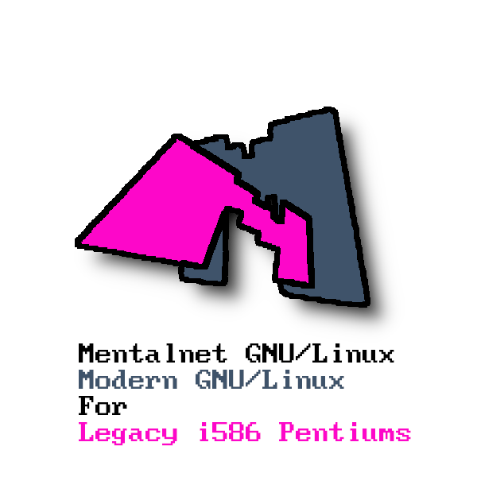

# Mentalnet GNU/Linux

A light, TTY-only GNU/Linux distribution for 90s Intel Pentium-class
(i586) machines, built with [Buildroot](https://buildroot.org).

<p align="center">
  
</p>

The ISO is a live CD: the entire system runs from the CD with a
read-only root filesystem, and the same CD carries a built-in hard
disk installer (`mentalnet-install`).

## Current release

**R1 "FirstStorm"** — named after DECO*27's
*Chūlán ~First Storm~* (初嵐～First Storm～).

## Versioning

- Major releases bump the `R<n>` number (`R1`, `R2`, ...).
- Minor releases keep the `R<n>` base version and use the codename as
  the minor version.
- All codenames are taken from Vocaloid, Hatsune Miku or Kasane Teto
  songs.

| Release | Codename | Song | Notes |
|---------|----------|------|-------|
| R1 | Mesmerizer | *Mesmerizer* — 32ki (Hatsune Miku & Kasane Teto) | Initial release |
| R1 | **FirstStorm** | *Chūlán ~First Storm~ (初嵐～First Storm～)* — DECO*27 | **Current** — swap-free installer, true i586 support, terminal/input hardening, interrupt-storm fixes |

## Quick facts

| | |
|---|---|
| Login | `root` / `mnlinux` |
| Hostname | `mentalnet` |
| Kernel | `6.12.104-mentalnet-intel32` |
| Media | Live CD with built-in installer |
| CPU | i586 (Pentium / Pentium MMX) or any newer x86 |
| RAM | 128 MB minimum (64 MB usually works) |

## Security after install

The default root password is **`mnlinux`** — please change it after
installing:

```
passwd
```

Then, for day-to-day use, create a regular user and give it sudo
privileges (sudo is included in the build):

```
adduser myuser
```

You have two options to grant sudo:

- Add the user to the `sudo` group, which the shipped sudoers file
  already trusts:

  ```
  addgroup myuser sudo
  ```

- Or, if you prefer the classic `wheel` group, enable it with
  `visudo` (uncomment the `%wheel` line) and add the user to it:

  ```
  visudo
  addgroup myuser wheel
  ```

**Verify that sudo works for the new user before locking root** —
log in as the user and run, for example, `sudo ls /`.

Once sudo is confirmed working, lock the root account so it cannot
be accessed (SSH included):

```
passwd -l root
```

## Documentation

The full install and test guide — hardware requirements, QEMU
testing, the install walkthrough and troubleshooting — lives in
[`board/mentalnet/INSTALL-GUIDE.md`](board/mentalnet/INSTALL-GUIDE.md).
