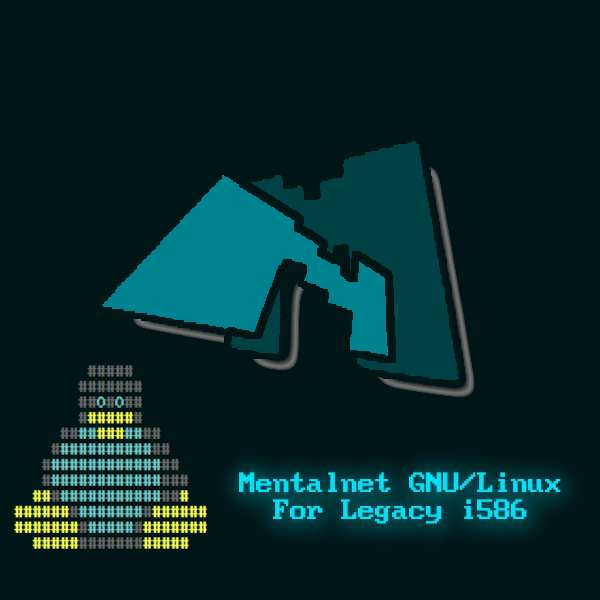

# Mentalnet GNU/Linux

A light, TTY-only GNU/Linux distribution for 90s Intel Pentium-class
(i586) machines, built with [Buildroot](https://buildroot.org).

<p align="center">
  
</p>

The ISO is a live CD: the entire system runs from the CD with a
read-only root filesystem, and the same CD carries a built-in hard
disk installer (`mentalnet-install`).

## Current release

**R1 "FirstStorm"** — named after DECO*27's
*Chūlán ~First Storm~* (初嵐～First Storm～).

## Versioning

- Major releases bump the `R<n>` number (`R1`, `R2`, ...).
- Minor releases keep the `R<n>` base version and use the codename as
  the minor version.
- All codenames are taken from Vocaloid, Hatsune Miku or Kasane Teto
  songs.

| Release | Codename | Song | Notes |
|---------|----------|------|-------|
| R1 | Mesmerizer | *Mesmerizer* — 32ki (Hatsune Miku & Kasane Teto) | Initial release |
| R1 | **FirstStorm** | *Chūlán ~First Storm~ (初嵐～First Storm～)* — DECO*27 | **Current** — swap-free installer, true i586 support, terminal/input hardening, interrupt-storm fixes |

## Quick facts

| | |
|---|---|
| Login | `root` / `mnlinux` |
| Hostname | `mentalnet` |
| Kernel | `6.12.104-mentalnet-intel32` |
| Media | Live CD with built-in installer |
| CPU | i586 (Pentium / Pentium MMX) or any newer x86 |
| RAM | 128 MB minimum (64 MB usually works) |

## Building from source

This repository is **not** a full Buildroot tree — it is an overlay
meant to be applied on top of a pristine Buildroot checkout.

1. Download and extract the pristine Buildroot 2025.02.17 LTS
   tarball (do not use a git checkout of master; this layer is
   written against 2025.02.17):

   ```
   wget https://buildroot.org/downloads/buildroot-2025.02.17.tar.gz
   tar xf buildroot-2025.02.17.tar.gz
   cd buildroot-2025.02.17
   ```

2. Copy this repository's contents over the extracted tree,
   preserving paths:

   | Source (this repo) | Destination (Buildroot tree) |
   |--------------------|------------------------------|
   | `board/mentalnet/` | `board/mentalnet/` |
   | `fs/iso9660/grub.cfg` | `fs/iso9660/grub.cfg` — **overwrites an upstream file** |
   | `.config` | `.config` |
   | `logos/`, `README.md`, `LICENSE` | same paths (repo-local, not used by the build) |

3. Build:

   ```
   make
   ```

   Host dependencies are listed in the
   [Buildroot manual](https://buildroot.org/downloads/manual/manual.html#requirement).
   Outputs land in `output/images/` — see the
   [install guide](board/mentalnet/INSTALL-GUIDE.md) for what each
   artifact is and how to test it.

The committed `.config` is based on the default i386 defconfig plus
the Mentalnet selections (GRUB2 embedded config, e2fsprogs, getty
TERM, and so on). Copying it reproduces the released system exactly;
alternatively, start fresh with `make menuconfig` and roll your own.

## Security after install

The default root password is **`mnlinux`** — please change it after
installing:

```
passwd
```

Then, for day-to-day use, create a regular user and give it sudo
privileges (sudo is included in the build):

```
adduser myuser
```

You have two options to grant sudo:

- Add the user to the `sudo` group, which the shipped sudoers file
  already trusts:

  ```
  addgroup myuser sudo
  ```

- Or, if you prefer the classic `wheel` group, enable it with
  `visudo` (uncomment the `%wheel` line) and add the user to it:

  ```
  visudo
  addgroup myuser wheel
  ```

**Verify that sudo works for the new user before locking root** —
log in as the user and run, for example, `sudo ls /`.

Once sudo is confirmed working, lock the root account so it cannot
be accessed (SSH included):

```
passwd -l root
```

## Documentation

The full install and test guide — hardware requirements, QEMU
testing, the install walkthrough and troubleshooting — lives in
[`board/mentalnet/INSTALL-GUIDE.md`](board/mentalnet/INSTALL-GUIDE.md).

## License

Mentalnet GNU/Linux — the scripts, configuration, documentation and
artwork added on top of Buildroot (`board/mentalnet/`, `logos/`,
`README.md`, `LICENSE`, and the modifications made to Buildroot
files) — is

> Copyright (C) 2026 Mark Robillard Jr (MARKMENTAL)
>
> SPDX-License-Identifier: GPL-3.0-or-later

This program is free software: you can redistribute it and/or modify
it under the terms of the GNU General Public License as published by
the Free Software Foundation, either version 3 of the License, or
(at your option) any later version. See [`LICENSE`](LICENSE).

The underlying [Buildroot](https://buildroot.org) tree remains under
its original license (see [`COPYING`](COPYING), GPL-2.0-or-later);
we claim no rights over it. This repository is an overlay meant to
be applied on top of a pristine Buildroot 2025.02.17 tree, not a
full fork.

The OS image produced by the build is an aggregation of many
components, each of which keeps its own license (the Linux kernel is
GPL-2.0, BusyBox is GPL-2.0, and so on).

The Mentalnet logo (`logos/mnlogo.jpg`) is part of this project and
licensed under GPL-3.0-or-later with the rest of it.
